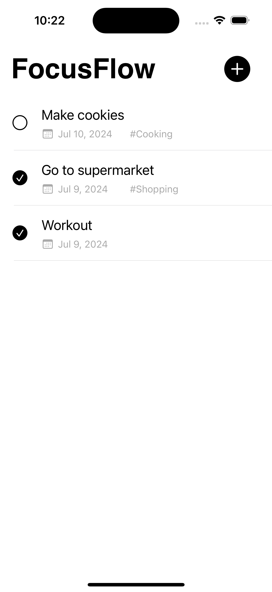
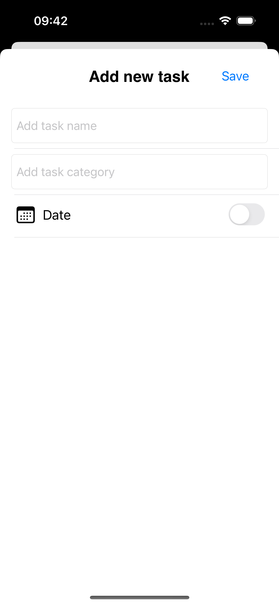

# ✅ To-Do List App

The to-do list app, named FocusFlow, is a simple and minimalist iOS application to help you manage your daily tasks.

## 📱Features

- Add new tasks easily with a task name, category, and date.
- View all your tasks in a list.
- Edit a task.
- Delete tasks.
- Mark a task as completed.

## 🔨 Technologies Used

- Swift Language
- UIKit: Framework for the user interface
- UserDefaults: For local data storage
- Xcode: Integrated Development Environment (IDE)
- Storyboard: for building the app's UI visually
- MVC (Model-View-Controller): Software architecture pattern used to organize and separate responsibilities in the project. 

     
